# AWS Lambda Image Processor

Procesador de imágenes serverless en AWS que recibe imágenes vía API, las almacena en S3 y genera automáticamente una versión recortada a círculo de 40×40 px con fondo transparente.

## Diagrama de Arquitectura

```mermaid
%%{
  init: {
    "theme": "base",
    "themeVariables": {
      "primaryColor": "#1e293b",
      "primaryTextColor": "#f8fafc",
      "primaryBorderColor": "#334155",
      "lineColor": "#94a3b8",
      "secondaryColor": "#0f172a",
      "tertiaryColor": "#1e293b",
      "background": "#0f172a",
      "mainBkg": "#1e293b",
      "nodeBorder": "#475569",
      "clusterBkg": "#0f172a",
      "titleColor": "#f8fafc",
      "edgeLabelBackground": "#1e293b",
      "fontFamily": "monospace"
    },
    "flowchart": { "curve": "basis", "padding": 20 }
  }
}%%

flowchart TD

  %% ── INTERNET ──────────────────────────────────────────────────────────────
  subgraph INTERNET["Internet"]
    CLIENT["Client\n---\nPOST /upload\nmultipart/form-data or JSON+base64\nMax size: 10 MB\nAllowed: jpg, png, gif, webp"]
  end

  %% ── AWS ACCOUNT ───────────────────────────────────────────────────────────
  subgraph AWS["AWS Account — Region: us-east-1"]

    %% ── EDGE SERVICES ─────────────────────────────────────────────────────
    subgraph EDGE["AWS Managed Edge Services — outside VPC"]

      APIGW["API Gateway HTTP API v2\n---\nRoute: POST /upload\nProtocol: HTTPS, TLS 1.2+\nPayload format: 2.0\nCORS: enabled\nStage: default, auto-deploy\nThrottling: 10,000 rps\nAccess logs to CloudWatch"]

      subgraph S3_SVC["Amazon S3 — Bucket: image-processor-env-images-suffix"]
        S3_UPLOADS["uploads/ prefix\n---\nStores: original images\nSSE: AES-256\nVersioning: enabled\nLifecycle: expire after 30 days\nAccess: fully private\nOn ObjectCreated fires SQS notification"]
        S3_PROCESSED["processed/ prefix\n---\nStores: cropped circular PNGs\nSSE: AES-256\nOutput: 40x40 px, PNG, transparent bg\nLifecycle: expire after 90 days\nAccess: fully private"]
      end

      subgraph SQS_SVC["Amazon SQS"]
        SQS_QUEUE["Main Queue\n---\nName: image-processor-env-image-queue\nType: Standard\nVisibility timeout: 360 s (6x Lambda timeout)\nRetention: 1 day\nLong polling: 20 s\nMax receives before DLQ: 3"]
        SQS_DLQ["Dead-Letter Queue\n---\nName: image-processor-env-image-dlq\nRetention: 14 days\nCloudWatch alarm on any visible message"]
      end

    end

    %% ── VPC ────────────────────────────────────────────────────────────────
    subgraph VPC["VPC — CIDR: 10.0.0.0/16 — DNS resolution and hostnames enabled"]

      IGW["Internet Gateway\n---\nAttached to VPC\nEntry point for inbound\npublic traffic"]

      %% ── PUBLIC SUBNETS ──────────────────────────────────────────────────
      subgraph PUB_A["Public Subnet AZ-a — 10.0.1.0/24 — Route 0.0.0.0/0 to IGW"]
        NAT_A["NAT Gateway A\n---\nElastic IP: allocated\nRoutes outbound traffic\nfor private subnet AZ-a"]
      end

      subgraph PUB_B["Public Subnet AZ-b — 10.0.2.0/24 — Route 0.0.0.0/0 to IGW"]
        NAT_B["NAT Gateway B\n---\nElastic IP: allocated\nRoutes outbound traffic\nfor private subnet AZ-b\nHigh-availability fallback"]
      end

      %% ── PRIVATE SUBNETS ─────────────────────────────────────────────────
      subgraph PRIV_A["Private Subnet AZ-a — 10.0.11.0/24 — Route 0.0.0.0/0 to NAT-A"]

        subgraph SG_UPLOAD["SG: sg-upload-lambda | Inbound: none | Outbound: TCP 443 to vpce-s3 and vpce-sqs"]
          LAMBDA_UPLOAD["upload-lambda\n---\nRuntime: nodejs20.x\nMemory: 256 MB — Timeout: 30 s\nHandler: index.handler\nEnv: S3_BUCKET, UPLOAD_PREFIX\nDeps: @aws-sdk/client-s3, busboy, uuid\nIAM: s3:PutObject on uploads/ only\nLogs: /aws/lambda/...-upload"]
        end

        subgraph SG_CROP["SG: sg-crop-lambda | Inbound: none | Outbound: TCP 443 to vpce-s3 and vpce-sqs"]
          LAMBDA_CROP["crop-lambda\n---\nRuntime: nodejs20.x\nMemory: 512 MB — Timeout: 60 s\nHandler: index.handler\nEnv: S3_BUCKET, PROCESSED_PREFIX\nDeps: @aws-sdk/client-s3, sharp 0.33\nCrop: resize 40x40 cover, SVG circle mask\nOutput: PNG with transparent alpha\nIAM: s3:GetObject uploads/, s3:PutObject processed/\nSQS: ReceiveMessage, DeleteMessage, ChangeVisibility\nLogs: /aws/lambda/...-crop"]
        end

      end

      subgraph PRIV_B["Private Subnet AZ-b — 10.0.12.0/24 — Route 0.0.0.0/0 to NAT-B"]
        LAMBDA_UPLOAD_B["upload-lambda replica AZ-b\n---\nIdentical config to AZ-a\nLambda auto-distributes ENIs\nacross both private subnets"]
        LAMBDA_CROP_B["crop-lambda replica AZ-b\n---\nIdentical config to AZ-a\nLambda auto-distributes ENIs\nacross both private subnets"]
      end

      %% ── VPC ENDPOINTS ───────────────────────────────────────────────────
      subgraph VPCE["VPC Endpoints — traffic stays on AWS backbone, never hits public internet"]

        VPCE_S3["S3 Gateway Endpoint\n---\nType: Gateway — free, no ENI\nService: com.amazonaws.us-east-1.s3\nInjected into private subnet route tables\nPolicy: s3:GetObject and s3:PutObject\nscoped to the images bucket only"]

        VPCE_SQS["SQS Interface Endpoint\n---\nType: Interface — ENI per AZ\nService: com.amazonaws.us-east-1.sqs\nPrivate DNS: enabled\nDeployed in: priv-a, priv-b\nSG: sg-vpce-sqs\nInbound TCP 443 from sg-upload-lambda\nInbound TCP 443 from sg-crop-lambda"]

      end

    end

    %% ── IAM ───────────────────────────────────────────────────────────────
    subgraph IAM["IAM — Least-Privilege Roles"]
      ROLE_UPLOAD["Role: upload-lambda-role\n---\nAWSLambdaBasicExecutionRole\nAWSLambdaVPCAccessExecutionRole\ns3:PutObject scoped to uploads/ only"]
      ROLE_CROP["Role: crop-lambda-role\n---\nAWSLambdaBasicExecutionRole\nAWSLambdaVPCAccessExecutionRole\ns3:GetObject on uploads/\ns3:PutObject on processed/\nsqs: ReceiveMessage, DeleteMessage\nGetQueueAttributes, ChangeMessageVisibility"]
    end

    %% ── OBSERVABILITY ─────────────────────────────────────────────────────
    subgraph OBS["Observability — CloudWatch"]
      CW_UPLOAD["Log Group\n/aws/lambda/...-upload\nRetention: 14 days"]
      CW_CROP["Log Group\n/aws/lambda/...-crop\nRetention: 14 days"]
      CW_APIGW["Log Group\n/aws/apigateway/...\nRetention: 14 days\nFormat: JSON access log"]
      CW_ALARM["CloudWatch Alarm: dlq-messages-alarm\n---\nMetric: ApproximateNumberOfMessagesVisible\nNamespace: AWS/SQS\nPeriod: 60 s — Threshold: above 0\nAction: notify via SNS topic"]
    end

  end

  %% ── DATA FLOW ─────────────────────────────────────────────────────────────

  CLIENT -->|"1 - HTTPS POST /upload, TLS 1.2+, max 10 MB"| APIGW
  APIGW -->|"2 - Lambda Proxy Invoke, Payload 2.0"| LAMBDA_UPLOAD
  APIGW -->|"2 - replica invoke"| LAMBDA_UPLOAD_B

  LAMBDA_UPLOAD -->|"3 - s3:PutObject via S3 Gateway Endpoint"| VPCE_S3
  LAMBDA_UPLOAD_B -->|"3 - replica"| VPCE_S3
  VPCE_S3 -->|"writes to uploads/"| S3_UPLOADS

  S3_UPLOADS -->|"4 - S3 Event Notification, ObjectCreated, AWS internal network"| SQS_QUEUE

  SQS_QUEUE -->|"5 - ESM trigger, batch size 5, ReportBatchItemFailures"| LAMBDA_CROP
  SQS_QUEUE -->|"5 - replica"| LAMBDA_CROP_B

  LAMBDA_CROP -->|"6 - s3:GetObject via S3 Gateway Endpoint"| VPCE_S3
  LAMBDA_CROP_B -->|"6 - replica"| VPCE_S3
  S3_UPLOADS -->|"reads from"| VPCE_S3

  LAMBDA_CROP -->|"7 - s3:PutObject, name_circular.png, 40x40 PNG"| VPCE_S3
  LAMBDA_CROP_B -->|"7 - replica"| VPCE_S3
  VPCE_S3 -->|"writes to processed/"| S3_PROCESSED

  LAMBDA_CROP -->|"sqs:ReceiveMessage and DeleteMessage via Interface Endpoint"| VPCE_SQS
  LAMBDA_CROP_B -->|"same"| VPCE_SQS
  VPCE_SQS -->|"connected to"| SQS_QUEUE

  SQS_QUEUE -->|"after 3 failed receives"| SQS_DLQ
  SQS_DLQ -.->|"triggers alarm"| CW_ALARM

  LAMBDA_UPLOAD -.->|"logs"| CW_UPLOAD
  LAMBDA_CROP -.->|"logs"| CW_CROP
  APIGW -.->|"access logs"| CW_APIGW

  LAMBDA_UPLOAD -.->|"assumes"| ROLE_UPLOAD
  LAMBDA_CROP -.->|"assumes"| ROLE_CROP

  IGW -.- NAT_A
  IGW -.- NAT_B

  %% ── STYLES ────────────────────────────────────────────────────────────────

  classDef clientNode fill:#0f172a,stroke:#6366f1,stroke-width:2px,color:#e0e7ff
  classDef edgeNode fill:#1e3a5f,stroke:#3b82f6,stroke-width:2px,color:#bfdbfe
  classDef lambdaNode fill:#14532d,stroke:#22c55e,stroke-width:2px,color:#dcfce7
  classDef s3Node fill:#3b1f0f,stroke:#f97316,stroke-width:2px,color:#ffedd5
  classDef sqsNode fill:#4a1d96,stroke:#a78bfa,stroke-width:2px,color:#ede9fe
  classDef iamNode fill:#1f2937,stroke:#facc15,stroke-width:2px,color:#fef9c3
  classDef obsNode fill:#1f2937,stroke:#94a3b8,stroke-width:2px,color:#e2e8f0
  classDef vpceNode fill:#0c2340,stroke:#38bdf8,stroke-width:2px,color:#bae6fd
  classDef natNode fill:#1c1917,stroke:#84cc16,stroke-width:2px,color:#d9f99d

  class CLIENT clientNode
  class APIGW,IGW edgeNode
  class LAMBDA_UPLOAD,LAMBDA_CROP,LAMBDA_UPLOAD_B,LAMBDA_CROP_B lambdaNode
  class S3_UPLOADS,S3_PROCESSED s3Node
  class SQS_QUEUE,SQS_DLQ sqsNode
  class ROLE_UPLOAD,ROLE_CROP iamNode
  class CW_UPLOAD,CW_CROP,CW_APIGW,CW_ALARM obsNode
  class VPCE_S3,VPCE_SQS vpceNode
  class NAT_A,NAT_B natNode
```



## Integrantes y Pull Requests

| # | Nombre | Rol | PR |
|---|--------|-----|-----|
| 1 | Vasquez Marquina, Yair Asael | Líder — Base, entornos y outputs | PR #1, PR #6 |
| 2 | Tarazona Aransaenz, Andrea Alejandra | Red (VPC, NAT, Endpoints, Security Groups) | PR #3 |
| 3 | Clavijo Diaz, Cesar Joaquin | Almacenamiento (S3, SQS, SNS, CloudWatch) | PR #4 |
| 4 | Mauricio Rodriguez, Diego Sebastian | Upload Lambda (API Gateway + upload-lambda) | PR #5 |
| 5 | Aguirre Saldaña, Glidis Lilani | Crop Lambda (crop-lambda + Event Source Mapping) | PR #7 |

## Requisitos Previos

- [Terraform](https://developer.hashicorp.com/terraform/downloads) >= 1.6
- [AWS CLI](https://aws.amazon.com/cli/) configurado con perfil `customprofile`
- [Node.js](https://nodejs.org/) >= 20 (para empaquetar las Lambdas)

Configurar el perfil AWS:
```bash
aws configure --profile customprofile
# AWS Access Key ID: <tu access key>
# AWS Secret Access Key: <tu secret key>
# Default region name: us-east-1
# Default output format: json
```

## Estructura del Repositorio

```
aws-lambda-image-processor/
├── modules/
│   └── image-processor/      # Módulo único con toda la lógica
│       ├── versions.tf        # Providers requeridos
│       ├── variables.tf       # Variables del módulo
│       ├── locals.tf          # Prefijos y nombre del bucket
│       ├── network.tf         # VPC, subredes, NAT, Endpoints, SGs
│       ├── storage.tf         # S3, SQS, SNS, CloudWatch
│       ├── upload.tf          # API Gateway + upload-lambda + IAM
│       └── crop.tf            # crop-lambda + Event Source Mapping + IAM
├── envs/
│   ├── dev/                   # Entorno de desarrollo
│   ├── qa/                    # Entorno de pruebas
│   └── prod/                  # Entorno de producción
└── src/
    ├── upload-lambda/         # Código Node.js de la upload-lambda
    └── crop-lambda/           # Código Node.js de la crop-lambda
```

Cada entorno (`dev`, `qa`, `prod`) es una carpeta independiente con su **propio estado local de Terraform**, lo que hace imposible destruir el entorno equivocado por accidente.

## Instrucciones de Despliegue

> ⚠️ **Importante:** Los entornos se despliegan **uno a la vez** (DEV → destruir → QA → destruir → PROD → destruir). La cuenta tiene cuota de 5 Elastic IPs por región; cada entorno usa 2. Desplegar los 3 simultáneamente fallaría.

**Paso 0 — Empaquetar las Lambdas (una sola vez desde la raíz del repo):**
```bash
cd src/upload-lambda && npm ci --omit=dev && cd ../..
cd src/crop-lambda && npm ci --omit=dev && npm install --os=linux --cpu=x64 sharp@0.33.5 && cd ../..
```

**Paso 1 — Desplegar un entorno (ejemplo: dev):**
```bash
cd envs/dev
terraform init
terraform validate
terraform plan -out=tfplan
terraform apply tfplan
terraform output
```

## Instrucciones de Prueba

Tras el `apply`, Terraform muestra los outputs. Esperar 1-2 minutos para que la conexión entre la cola SQS y `crop-lambda` se active.

**Probar la subida de una imagen (< 1 MB):**
```bash
curl -X POST -F "file=@prueba.jpg" "$(terraform output -raw upload_url)"
# Respuesta esperada: 201 {"key":"uploads/<uuid>.jpg"}
```

> ⚠️ **Limitación de tamaño:** API Gateway acepta hasta 10 MB, pero una invocación síncrona de Lambda acepta como máximo 6 MB de payload (el cuerpo llega codificado en base64, lo que infla el tamaño ~33 %). **Usar imágenes menores a 1 MB para las pruebas.**

**Verificar que la imagen fue recortada y guardada en `processed/`:**
```bash
BUCKET=$(terraform output -raw bucket_name)
aws s3 ls "s3://$BUCKET/uploads/"   --profile customprofile
aws s3 ls "s3://$BUCKET/processed/" --profile customprofile
```

**¿Por qué multipart/form-data?** El diagrama lista `busboy` como dependencia de `upload-lambda`, y busboy es un parser de multipart. Además, es el estándar para subir archivos: funciona directo con `curl -F`, Postman y formularios HTML, sin que el cliente tenga que codificar nada en base64.

## Instrucciones de Destrucción

Destruir INMEDIATAMENTE después de las pruebas para no generar costos:
```bash
cd envs/dev
terraform destroy
```
Repetir para `envs/qa` y `envs/prod`.

> ⚠️ **El destroy de Lambdas en VPC puede tardar 20-40 minutos** porque AWS libera sus interfaces de red con retraso. No cancelar el comando. Si falla con `DependencyViolation`, esperar unos minutos y volver a ejecutar `terraform destroy`.

## Advertencia de Costos

- Los NAT Gateways son el recurso más caro (~$0.045/hora por unidad × 2 = ~$0.09/hora).
- Destruir siempre al terminar. Nunca dejar un entorno encendido de un día para otro.
- El presupuesto configurado en la cuenta es de $1 USD con alerta al 80%.

